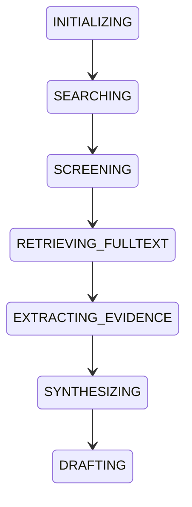
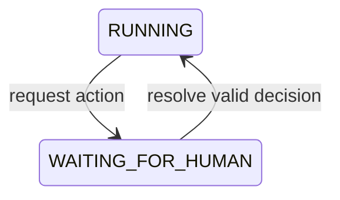
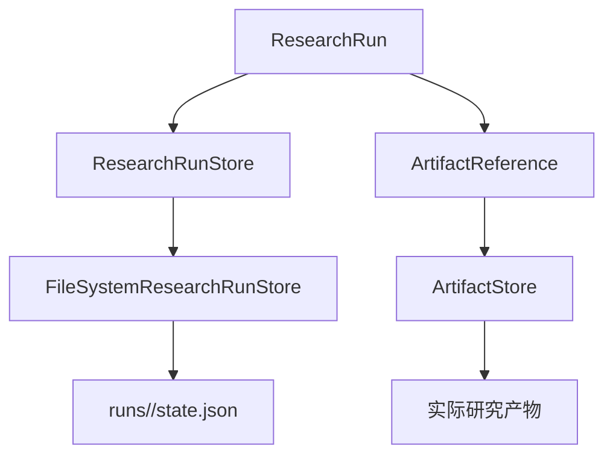

# ResearchRun 状态基础

`ResearchRun`、状态机、单步执行器、Human Gate 和最小 `EvidenceAgent` 共同提供可恢复的运行时基础。具体 Service handler 仍由 composition root 注入。

## ResearchRun 是什么

`ResearchRun` 表示一次研究任务当前的轻量运行状态，包含任务身份、研究问题、当前状态、当前阶段、搜索轮次摘要、业务产物引用、失败元数据和时间戳。

它不保存论文全文、论文列表、EvidenceCard、EvidenceSynthesis、ReviewDraft 或日志正文。这些内容仍由 `RunArtifactStore` 保存。

每个 Agent 目标还会保存一个独立的 `ResearchBrief`，位于
`agent/research_brief.json`。它描述研究问题、人群、干预或暴露、结局、纳排标准、
语言、研究类型和年份范围。旧版只包含 objective/research_question 的 goal artifact
仍可加载；系统会为其生成与研究问题一致的最小 brief。ResearchBrief 只负责明确研究
边界，不改变既有文献检索、证据卡或草稿算法。

## Status 与 Stage

`RunStatus` 表示任务整体状态，例如 `created`、`running`、`waiting_for_human`、`completed`、`failed` 和 `cancelled`。

`RunStage` 表示当前业务阶段，例如 `searching`、`screening`、`retrieving_fulltext`、`extracting_evidence`、`synthesizing` 和 `drafting`。两者是正交维度，例如：

```text
status = waiting_for_human
stage  = retrieving_fulltext
```

`RunStateMachine` 是纯 deterministic 组件。它只验证并应用合法的 Stage/Status 转换，更新 `updated_at`，不调用 Service、网络或持久化 Store。

当前 Stage 图为：



`DRAFTING` 是当前 Stage 图的终点。非法转换会抛出项目级 `InvalidStateTransitionError`。`RunStatus` 也有独立的最小规则，`COMPLETED`、`FAILED` 和 `CANCELLED` 是终态；`COMPLETED` 只允许在 `DRAFTING` 阶段设置。

## StepExecutor

`StepExecutor.execute_one_step(run)` 通过 composition root 注入的 handler 执行当前阶段对应的 Application Service。它只接受 `RUNNING` 任务；如果 handler 通过 Human Gate 创建了 pending action，则必须返回带有 action ID 的 blocked `StepResult`。

```text
SEARCHING             -> LiteratureSearchService
SCREENING             -> ScreeningService
RETRIEVING_FULLTEXT   -> FullTextService
EXTRACTING_EVIDENCE   -> EvidenceExtractionService
SYNTHESIZING          -> deterministic synthesis service handler
DRAFTING              -> ReviewDraftService
```

`services/workflow.py` 将这些 handler 通过 Port 接到既有 Application Service；它不改变 Service 内的检索、提示词、Schema 或证据校验算法。`bootstrap.py` 是唯一实例化 concrete adapter 的位置。StepExecutor 会先检查所需 ArtifactReference，返回轻量 typed `StepResult`，不会直接依赖 concrete Adapter，也不会修改下一阶段或自动执行下一步。成功步骤必须提交该阶段要求的 artifact；缺少输入时抛出 `MissingStageInputError`。

## EvidenceAgent

`EvidenceAgent.start(run)` 只负责将 `CREATED` 任务持久化为 `RUNNING`。`run_until_blocked(run)` 随后重复执行当前阶段、登记新 artifact、通过状态机推进阶段并保存状态，直到出现以下情况之一：

- handler 返回 blocked `StepResult`，且任务处于 `WAITING_FOR_HUMAN`；
- 单步执行失败，任务进入 `FAILED` 并保存结构化失败；
- `DRAFTING` 成功完成，任务进入 `COMPLETED` 并写入 `completed_at`；
- 任务原本已经处于等待或终态，调用直接返回，不重复执行。

固定 `EvidenceAgent` 编排器只协调已有契约，不选择查询式、不修改 Prompt、不解析 provider 原始 payload，也不把大对象写进 `ResearchRun`。需要受控规划时，由下文的 `AgentController` 提供 Planner、Re-plan 和 Agent Event Trace；两者共享同一状态机、Human Gate 与业务 Service 边界。

## Human Gate

人工审核是正式 runtime control，而不是只在业务输出中留下 warning。`HumanGate` 只处理 pause、持久化、决策校验和恢复可继续状态：



暂停只改变 `RunStatus`，不会改变业务 `RunStage`。例如合法全文不可得时，运行可保持在 `retrieving_fulltext`，同时从 `running` 进入 `waiting_for_human`。

当前稳定支持两类 action：

- `fulltext_required`：`provide_fulltext`（必须引用 `FULLTEXT_DOCUMENT` ArtifactReference）或 `skip_paper`。
- `screening_review_required`：`include`、`exclude` 或 `keep_uncertain`。

`PendingHumanAction` 和 `HumanDecision` 都作为轻量 `ResearchRun.human_actions` 状态保存到 `state.json`。决策不会覆盖原始 Screening artifact；它作为 action 的结构化 resolution 保留。resolve 成功后只恢复 `waiting_for_human -> running`，不会在 Human Gate 内自动执行当前或后续 workflow step；调用方可以随后显式调用 `EvidenceAgent.run_until_blocked()` 继续。

## 细粒度 checkpoint 与受控重试

`services/checkpoints.py` 提供轻量 `WorkflowCheckpointStore`。每个 run 的 `artifacts/workflow_checkpoints.json` 只记录阶段、工作单元、输入指纹、状态、尝试次数、错误和输出 artifact key；论文列表、全文、证据卡等大对象仍留在独立 artifact 中。当前可恢复单元包括：

- 搜索 query；
- 初筛 batch；
- 全文候选发现与文档下载；
- 单篇证据卡提取；
- 汇总与初稿生成。

重启或 `pea run resume` 时，只有状态为 `completed` 且输入指纹仍匹配的单元会被复用。研究问题、阶段输入、Prompt 或 Schema 资源发生变化时，旧结果会失效并重新执行；因此不会把过期证据当作当前输入的结果。单元完成后立即保存 checkpoint，减少中断造成的重复工作。

`pea run retry <run_id>` 只允许从带有 `retryable=true` 的结构化失败恢复，并且和其他会修改 run 的命令一样受单 run 进程锁与 revision 检查保护。它不会跳过 Human Gate，也不会把不可重试的 Schema、契约或业务校验错误自动重跑。

## Bounded Research Agent

`runtime/agent_controller.py` 在上述固定阶段运行时之上提供受控的 Agent 层。它遵循 `observe -> plan -> policy check -> execute one tool -> evaluate -> continue/re-plan` 循环，但不替换现有 Application Service：`services/agent_tools/` 将既有阶段 handler 与受控的类型化工具注册到唯一 Agent 工具目录。

Agent 的职责边界如下：

- `AgentPlanner` 只能提出 `AgentPlan`，不能授予执行权限；
- `PlanPolicyGuard` 确认工具已注册、参数合法、依赖无环且工具对应当前 `RunStage`；
- `PlanExecutor` 只执行一个已经通过策略检查的工具；
- `OutcomeEvaluator` 根据 ToolResult 确定性判断继续、完成、等待、重试或失败；
- `ExecutionBudget` 限制工具步骤、重规划、模型调用和单步尝试；
- `FileSystemAgentEventStore` 保存 append-only 事件，但不保存论文全文、Prompt、模型思维过程或原始 provider payload。

工具参数通过 `ToolArgumentSpec` 声明，并由 `PlanPolicyGuard` 在执行前校验必填字段和
JSON 兼容类型。检索阶段提供 `search.execute_query`、`search.finalize` 和
`search.assess_coverage` 三个受控工具：
前者可以在当前 `SEARCHING` 阶段执行一条有预算的查询，后者将查询 artifact 去重并生成
既有筛选服务使用的 `search_results.json`，最后一个工具只读取元数据计数、查询覆盖和
ResearchBrief 范围信号，生成 `agent/research_quality_report.json`。质量达标时才结束搜索阶段；
候选不足时返回受控的 re-plan 信号，达到搜索轮次上限时以不可重试失败安全停止。质量报告不保存
摘要、全文、provider 原始响应或模型思维过程。因此一个工具可以成功完成但暂不结束当前业务
阶段；这种状态会写入计划，进程恢复时不会错误地跳过后续检索步骤。

筛选阶段提供 `screen.execute_batches` 与 `screen.finalize`。前者只接收受限的筛选数量、
是否筛选全部候选和单批大小参数，调用既有 `ScreeningService`，并把每个结构化输出批次
单独保存到 `agent/screening_batches/`；后者验证批次 paper ID 完整性后生成原有的
`screening_results.json`。如果筛选结果包含 `human_review_note`，finalize 会复用现有
Screening Human Gate，恢复后重新汇总人工决策，不绕过原有 Schema 或人工审核规则。

全文阶段提供 `fulltext.prepare`、`fulltext.process_next` 与 `fulltext.finalize`。前者只从已验证的
`screening_results.json` 生成有限队列；中间工具一次只处理受限数量的论文，复用既有合法开放获取
发现服务和 PDF 下载器，并把队列状态与批次元数据保存到 `agent/fulltext_queue.json` 和
`agent/fulltext_batches/`。没有明确合法 PDF、下载失败或仅有落地页时，仍然使用同一个
`FULLTEXT_REQUIRED` Human Gate；人工提供的文件必须是当前 run 中的 `FULLTEXT_DOCUMENT` artifact。
最后一个工具只有在每个队列项已下载、人工提供或跳过后，才发布原有的
`fulltext_metadata.json` 和 `fulltext_documents.json`，不会绕过付费墙或把任意 URL 交给 Planner。

证据提取阶段提供 `evidence.prepare`、`evidence.process_next` 与 `evidence.finalize`。队列只保存
paper ID、全文 artifact key、输入指纹和卡片状态，不保存论文正文；处理中通过现有
`DocumentReaderPort` 读取全文，再由 `EvidenceExtractionService` 调用结构化输出、Pydantic 模型、
JSON Schema 和独立 inference-boundary 校验。每张卡片使用既有的 `evidence_cards/*.json` key 和
checkpoint，只有真实生成或验证通过的卡片才会登记为 `EVIDENCE_CARD`；队列本身不会伪装成业务产物。

默认 `CodexPlanner` 只接收研究目标、轻量运行摘要和工具描述，不接收论文全文。规划层离线测试可使用 `DeterministicPlanner`；两者的计划都会经过相同的本地 Policy Guard。实际 `workflow.*` 和 `search.*` 工具仍按原有 adapter 调用 OpenAlex、Codex 或开放获取 provider。当前 Agent 只能调用注册工具，因此不会因为 Planner 输出而获得任意网络、文件系统或命令执行能力。

Agent 计划和运行元数据位于：

```text
data/runs/<run_id>/
├─ state.json
├─ events.jsonl
└─ artifacts/agent/
   ├─ goal.json
   ├─ plan.json
   ├─ budget.json
   └─ options.json
```

### Web Agent 的取消与恢复

网页端停止运行采用合作式取消，而不是让请求方强行修改正在执行的
`ResearchRun`。取消接口会在当前 run 的 `control/cancel.requested` 写入一个短小的
持久化信号；Agent 在计划、工具步骤和结果处理之间的安全边界检查该信号，再通过
`RunStateMachine` 转换到 `CANCELLED`，并写入 `RUN_CANCELLED` 事件。这样停止请求不需要
等待后台 worker 释放 run lock，也不会在外部工具调用中途破坏状态。

服务重启后，如果 `state.json` 仍为 `RUNNING` 但没有对应的后台 worker，API 快照会标记
`recovery_available=true`。网页端可以调用已有的 `resume` 接口，从最近保存的 plan 和
checkpoint 继续；恢复前会清理上一轮遗留的取消信号。取消信号不属于 `ResearchRun` 业务
状态，因此不会把控制标记混入领域模型或研究产物。

发生人工暂停时，当前计划会保留为 `waiting` 步骤；Human Gate 决策完成后，该步骤恢复为待执行状态。发生进程中断时，`running` 步骤会在下次启动时重新排队，业务阶段的细粒度 checkpoint 负责避免可复用工作被重复执行。

## 两个持久化边界



`FileSystemResearchRunStore` 使用 UTF-8、ISO 8601 timezone-aware 时间和临时文件替换，保存路径为 `<root>/runs/<run_id>/state.json`。每次成功更新会递增 `ResearchRun.revision`；保存前会比较磁盘版本，旧快照会被拒绝为并发冲突，不会静默覆盖新状态。加载时重新通过 Pydantic 验证；缺失、损坏、重复创建和陈旧写入分别转换为项目级 persistence error。`FileSystemResearchRunLock` 在同一目录维护 OS 级独占锁，CLI 的 `start`、`resume`、`retry`、`resolve` 和 `cancel` 会覆盖完整的 load -> execute/copy -> persist 生命周期，避免两个进程同时推进同一个 run。锁文件不应手动删除；进程异常退出时由操作系统释放锁。

Codex CLI adapter 会为一次调用创建独立进程组。超时路径会尝试终止整个进程树（Windows 使用 `taskkill /T`，POSIX 使用进程组终止），同时保留 `--sandbox read-only`、临时输出文件和结构化结果验证。

## 当前限制

当前使用本地文件系统，不实现数据库级事务、run list、跨机器协调或分布式 Agent Event Trace。Planner、Re-plan、细粒度 checkpoint 和受控 `retry` 已在本地 Agent 运行时中提供；检索、筛选、全文和证据卡阶段使用类型化、受限的 Agent 工具，综合和草稿保持既有固定阶段工具，以维持确定性证据综合和可验证草稿边界。系统不支持开放式新工具发现；全文人工提供可以通过 `pea run resolve` 或本地网页 Human Gate 上传，文件会复制到当前 run 的 artifact 区并记录为 `FULLTEXT_DOCUMENT`；系统仍不会绕过付费墙或机构访问控制。

## 发布验收范围

自动化验收覆盖固定工作流、受控 Agent controller、重规划、分批队列、Human Gate、持久化恢复、Schema/inference-boundary 校验和 package 安装。所有外部论文服务与 Codex 调用均由 test fixture mock；CI 不访问网络、模型或论文 API。

本地真实试运行属于单独的人工验收：应使用范围很小的研究问题、明确的预算和合法开放获取来源，并且不得将获得的论文、运行日志或模型原始输出提交到仓库。
