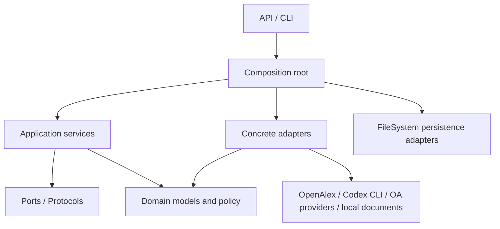
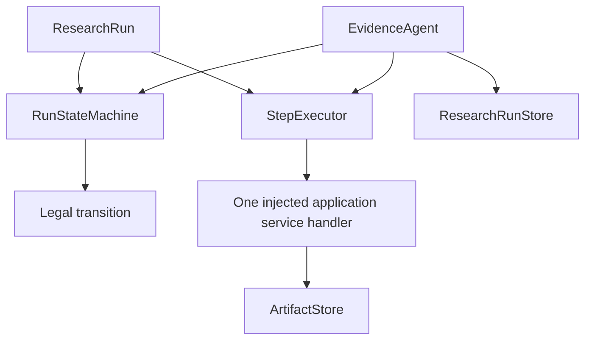
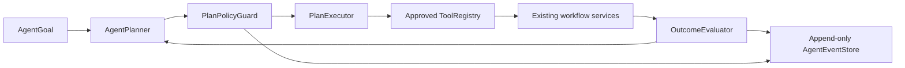

# Application architecture

The project uses a deliberately small, one-way dependency structure:

The runtime adds deliberately separate state, execution, gate, and orchestration components:

The bounded Agent layer adds a proposal-and-authorization loop without giving the planner direct infrastructure access:

## Search control boundary

The browser research-intake flow exposes one search console with two user modes:

- **Automatic mode** lets the Agent derive a bounded query from the confirmed
  `ResearchBrief`.
- **Manual mode** persists the user's literal query and prevents a model planner from
  replacing it. The user can also set the publication-year range and candidate limit.

Both modes create the same `AgentGoal` and pass through the same registered
`search.execute_query`, `search.finalize`, coverage assessment, screening, Human Gate, and
evidence stages. The finalized `search_results.json` artifact is the only browser result
source for a run. The standalone literature-search route remains a low-level compatibility
endpoint for provider/debug use; it is not a second screening pipeline or a separate UI
state.

- `RunStateMachine` is pure transition policy. It does not call a service, adapter, network, or persistence implementation.
- `StepExecutor` executes exactly one current-stage handler and returns a typed `StepResult`; it does not select the next stage or run a loop.
- `EvidenceAgent` owns the execute/transition/save lifecycle. It runs the injected steps until a human gate, failure, or completion and remains independent of provider APIs and artifact contents.

`HumanGate` depends only on `ResearchRun`, `RunStateMachine`, and the `ResearchRunStore` port. It persists a lightweight pending action, transitions `RUNNING` to `WAITING_FOR_HUMAN`, validates an action-specific human decision, and then transitions back to `RUNNING` only when no blocking action remains. It does not import providers, concrete adapters, or start another step.

- `domain/` contains stable Pydantic contracts and project exceptions. It never imports transport, FastAPI, subprocess, or document libraries.
- `services/` implements deterministic application use cases and only depends on domain objects and ports.
- `ports/` describes required capabilities with `Protocol`.
- `adapters/` owns provider URLs, HTTP, subprocess, raw payload mapping, and local-document integration.
- Public-access lookup is split by provider: `UnpaywallAdapter` handles DOI/location metadata,
  while `EuropePmcAdapter` handles PMC full-text metadata. Both use the shared `HttpJsonClient`
  with explicit timeout and bounded retry policy; `Retry-After` is honored for numeric values.
- `RunArtifactStore` stores business artifacts, while `ResearchRunStore` stores only lightweight
  `ResearchRun` state. `FileSystemResearchRunStore` persists validated state atomically at
  `<root>/runs/<run_id>/state.json`; neither persistence adapter introduces a database or a
  ResearchRun state machine.
- `FileSystemResearchRunLock` is the process-safety boundary for mutable runs. The CLI acquires
  `<root>/runs/<run_id>/.run.lock` before loading a run and keeps it through workflow execution,
  human resolution, artifact copying, and state persistence. The lock is OS-managed and is
  released automatically if the owning process exits. `ResearchRun.revision` adds an optimistic
  stale-write check inside `FileSystemResearchRunStore`; atomic state replacement remains the
  crash-safety boundary.
- Screening uses `ScreeningService` and `StructuredOutputPort`; synthesis is currently a
  deterministic local matrix builder and therefore does not call Codex.
- `bootstrap.py` is the composition root. API routes and CLI commands request services there; they do not name concrete provider implementations.
- `services/workflow.py` provides the injected stage handlers used by the persisted run orchestrator. It coordinates existing services and artifact references, while provider and document implementations remain behind ports and adapters.
- `services/checkpoints.py` persists fine-grained workflow-unit metadata separately from `ResearchRun`; query, screening-batch, full-text, evidence-card, synthesis, and draft outputs remain ordinary artifacts. An input fingerprint is required before a completed unit is reused, so changed stage inputs invalidate stale work without storing large objects in runtime state.
- `runtime/agent_controller.py` owns the bounded Agent loop. `AgentPlanner` proposals pass through `PlanPolicyGuard` before `PlanExecutor` can call a registered `workflow.*` tool; `OutcomeEvaluator` makes the continue/complete/wait/retry/fail decision deterministically. The planner sees only sanitized run summaries and tool descriptors, while `FileSystemAgentEventStore` records redacted operational events.
- Agent tool descriptors may declare typed `argument_specs`. The policy guard validates required names and JSON-compatible value types before execution. The search vertical slice exposes `search.execute_query`, `search.finalize`, and `search.assess_coverage`; the latter persists a metadata-only `ResearchQualityReport` and deterministically selects proceed, bounded re-plan, or safe stop without forwarding paper text to the planner. The screening vertical slice exposes `screen.execute_batches` and `screen.finalize`, which reuse the existing `ScreeningService`, JSON Schema validation, persisted batch artifacts, and Screening Human Gate. The full-text vertical slice exposes `fulltext.prepare`, `fulltext.process_next`, and `fulltext.finalize`; it processes a bounded queue from validated screening artifacts, reuses the lawful OA adapters and downloader through ports, and preserves the existing `FULLTEXT_REQUIRED` Human Gate. The evidence vertical slice exposes `evidence.prepare`, `evidence.process_next`, and `evidence.finalize`; it queues only artifact keys and input fingerprints, then reuses the existing document reader, structured-output service, schema validation, inference-boundary validation, and checkpoints.
- `configuration.py` validates the complete search configuration at the CLI boundary, including required fields and unique query IDs, before any provider request is made.

The runtime has a deliberately small Agent orchestrator. The current composition root binds the approved provider and tool set explicitly; the planner may re-plan only within those registered capabilities, and autonomous policy changes remain outside its scope. `pea run retry` only re-enters runs with an explicitly retryable structured failure, while checkpoint reuse remains input-fingerprint guarded. `pea run cancel` uses the existing deterministic terminal transition and does not add a separate cancellation workflow.

The legacy `open_access_fulltext.py` module remains a compatibility implementation for its
public functions and download helper. New provider discovery flows use the separate adapters;
the legacy module is retained only for old imports and lawful PDF download compatibility.
